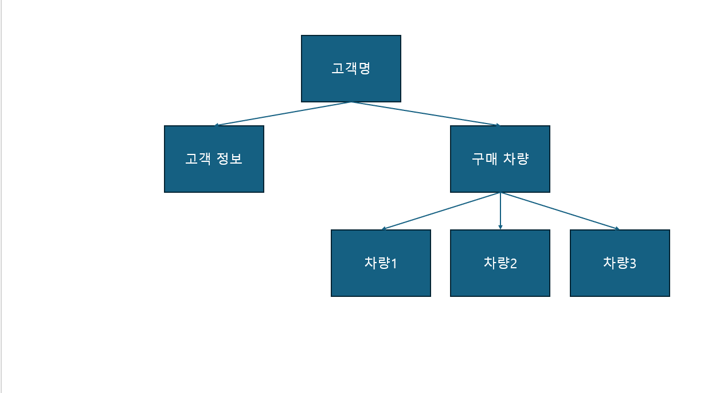
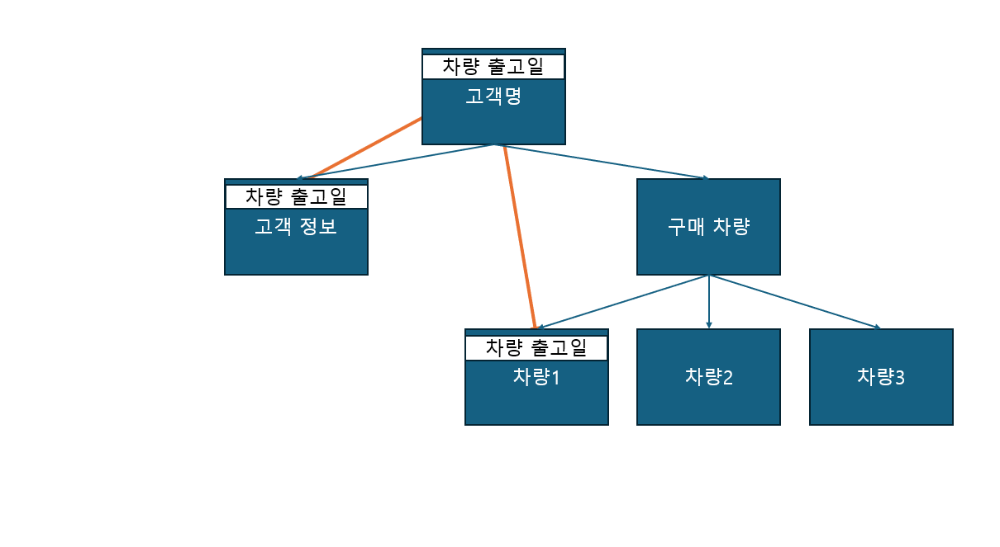

## 1. 나는 component를 나누는 나만의 기준이 있으며, 반드시 나누는 기준에 대해서도 알고 있다.

1. 나만의 기준

-   하나의 기능 혹은 디자인을 프로젝트 여러 곳에서 재사용 할 때
-   하나의 파일 안에 너무 많은 기능이 있을 때

2. 자주 접속하는 사이트 나눠보기

## 2. 나는 hook 함수의 종류와 기능, 어느 순간 사용 해야할지 정의할 수 있다

### 1. useState

1. 용도  
   state 변수를 만들 때 사용한다. state 변수가 바뀌어야 리랜더링이 발생하므로 리렌더링을 통해 화면에 표시되는 값을 바꿔야 할 때 쓰인다.
2. 구조

-   const[name, setName] = useState(초기값)

*   처음에 name 자리에 들어갈 초기값을 useState의 매개변수 자리에 적는다.
*   set 함수는 state 변수의 값을 어떻게 바꿀지 적는 자리로 state 변수에 들어갈 값 혹은 들어갈 값을 계산하는 함수를 넘겨받는다.

3. 주의 사항

-   set 함수로 변경된 state 변수는 다음 렌더부터 변경사항이 적용된다.
    -   state가 바뀌더라도 리렌더는 바로 일어나지 않고 다른 코드 실행이 끝난 다음에 일어난다.
    -   따라서 set 함수 아래에서 state에 접근해도 변경 전 state 값만 나온다.

4. [예시](hooks/src/examples/problem2/useStateEx.jsx)

### 2. useRef

1.  리렌더링 시 초기화되지 않는 변수가 필요할 때 사용한다.
2.  주의 사항: 값에 접근할 때 반드시 current.value 형식으로 접근해야 한다.
3.  [예시](hooks/src/examples/problem2/useRefEx.jsx)

### 3. useEffect

1.  첫 렌더링 혹은 특정 변수가 변화할 때 작동해야 하는 코드를 쓸 때 사용한다.
2.  구조: useEffect(setup, dependencies)

-   setup: useEffect로 수행할 코드가 들어간다.
-   dependencies: useEffect 실행에 관여할 변수 혹은 함수가 들어간다.
    -   요소 숫자가 일정한 배열 형태로 들어간다.
    -   배열 안의 변수 혹은 함수가 이전과 달라지면 useEffect가 작동한다.
    -   빈 배열이 들어가면 첫 렌더 때만 작동한다.
    -   아무 것도 안 들어가면 렌더할 때 마다 작동한다.

3. [예시](hooks/src/examples/problem2/useEffectEx.jsx)

## 3. 나는 전역 상태 관리를 하는 방법의 종류와 어느 순간 전역 상태를 관리해야할지 단순 설명뿐이 아니라 판단할 수 있다.

1. 전역 상태 관리 방법 종류: context api, ???
2. 용도
    - a. props drilling이 일어날 때
    - b. 부모가 알 필요 없는 값을 알고 있을 때
    - c. 예시
        - 어느 자동차 판매사의 고객 관리 데이터는 다음과 같은 구조로 이루어져 있다.
          
        - 각 차량 정보에 저장된 차량 출고일을 고객 정보에서도 쓴다고 하자. 전역 상태 관리를 안 쓴다면 최상위 컴포넌트인 "고객명" 컴포넌트에 차량 출고일을 저장해야 한다. [예시 코드]()
          

## 4. 나는 CRUD를 활용한 상태 변경과 UI 변경 시점에 따른 리랜더링을 자유롭게 다룰 수 있다.
