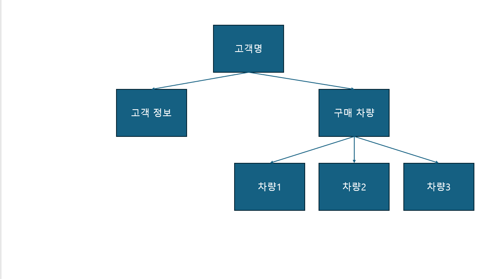
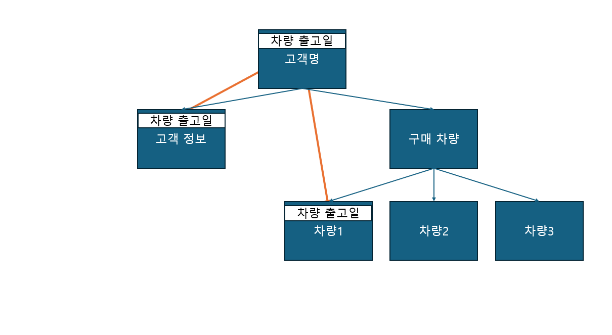

## 1. 나는 component를 나누는 나만의 기준이 있으며, 반드시 나누는 기준에 대해서도 알고 있다.

1. 나만의 기준

-   하나의 기능 혹은 디자인을 프로젝트 여러 곳에서 재사용 할 때
-   하나의 파일 안에 너무 많은 기능이 있을 때

2. 자주 접속하는 사이트 나눠보기

## 2. 나는 hook 함수의 종류와 기능, 어느 순간 사용 해야할지 정의할 수 있다

### 1. useState

1. 용도  
   state 변수를 만들 때 사용한다. state 변수가 바뀌어야 리랜더링이 발생하므로 리렌더링을 통해 화면에 표시되는 값을 바꿔야 할 때 쓰인다.
2. 구조

-   const[name, setName] = useState(초기값)

*   처음에 name 자리에 들어갈 초기값을 useState의 매개변수 자리에 적는다.
*   set 함수는 state 변수의 값을 어떻게 바꿀지 적는 자리로 state 변수에 들어갈 값 혹은 들어갈 값을 계산하는 함수를 넘겨받는다.

3. 주의 사항

-   set 함수로 변경된 state 변수는 다음 렌더부터 변경사항이 적용된다.
    -   state가 바뀌더라도 리렌더는 바로 일어나지 않고 다른 코드 실행이 끝난 다음에 일어난다.
    -   따라서 set 함수 아래에서 state에 접근해도 변경 전 state 값만 나온다.

4. [예시](hooks/src/examples/problem2/useStateEx.jsx)

### 2. useRef

1.  리렌더링 시 초기화되지 않는 변수가 필요할 때 사용한다.
2.  주의 사항: 값에 접근할 때 반드시 current.value 형식으로 접근해야 한다.
3.  [예시](hooks/src/examples/problem2/useRefEx.jsx)

### 3. useEffect

1.  첫 렌더링 혹은 특정 변수가 변화할 때 작동해야 하는 코드를 쓸 때 사용한다.
2.  구조: useEffect(setup, dependencies)

-   setup: useEffect로 수행할 코드가 들어간다.
-   dependencies: useEffect 실행에 관여할 변수 혹은 함수가 들어간다.
    -   요소 숫자가 일정한 배열 형태로 들어간다.
    -   배열 안의 변수 혹은 함수가 이전과 달라지면 useEffect가 작동한다.
    -   빈 배열이 들어가면 첫 렌더 때만 작동한다.
    -   아무 것도 안 들어가면 렌더할 때 마다 작동한다.

3. [예시](hooks/src/examples/problem2/useEffectEx.jsx)

## 3. 나는 전역 상태 관리를 하는 방법의 종류와 어느 순간 전역 상태를 관리해야할지 단순 설명뿐이 아니라 판단할 수 있다.

1. 전역 상태 관리 방법 종류: context api, ???
2. 용도
    - a. props drilling이 일어날 때
    - b. 부모가 알 필요 없는 값을 알고 있을 때
    - c. 예시
        - 어느 자동차 판매사의 고객 관리 데이터는 다음과 같은 구조로 이루어져 있다.
          
        - 각 차량 정보에 저장된 차량 출고일을 고객 정보에서도 쓴다고 하자. 전역 상태 관리를 안 쓴다면 최상위 컴포넌트인 "고객명" 컴포넌트에 차량 출고일을 저장해야 한다. [예시 코드]()
          

## 4. 나는 CRUD를 활용한 상태 변경과 UI 변경 시점에 따른 리랜더링을 자유롭게 다룰 수 있다.

[예시]

## 5. 나는 중첩 객체 배열의 CRUD와 상태 변화를 자유롭게 다룰 수 있다.

1. 중첩 객체 배열에서 안에 들어있는 객체 배열에 push 등으로 단순히 값을 추가하면 리액트는 안쪽 배열의 변화를 감지하지 못해 리렌더링이 일어나지 않을 수 있다.

-   예시: 예시 자료에서 그냥 post[Comments].push(newComment) 이런 식으로 새로운 자료를 추가하면 state 변수에 있는 post의 주소 값은 변함이 없으므로 state가 바뀌지 않은 걸로 취급된다.

## 6. 나는 재사용이 가능한 컴포넌트를 만들 수 있는 방법을 알고 있으며 만들 수 있다.

1. 적어도 세 컴포넌트 이상에서 로직이 비슷한 컴포넌트를 사용한다면(= props 추가만으로 모든 컴포넌트에서 재사용이 가능하다면) 재사용이 가능한 컴포넌트로 만든다.
   src 바로 아래 components 폴더에 재사용할 컴포넌트를 만들고, 다른 컴포넌트에서 사용한다. props를 통해 상황에 맞게 적용한다.

## 7. 나는 Promise와 async/await을 왜 사용해야하는지 알고 있으며, 예외처리를 할 수 있다.

1. (Promise를 써야 하는 상황과 async/await를 써야 하는 상황이 따로 있었나?)
   Promise: 비동기의 결과값은 다른 코드가 다 실행되어야 return 되므로 다른 함수에서 비동기 함수의 결과값을 사용하려 하면 콜백 지옥이 발생한다. 이걸 막기 위해서 Promise를 쓴다.
   async/await: Promise를 쓰다 보니 then() 문구가 계속 길게 이어진다. 이걸 막기 위해 async/await를 쓴다.
2. Promise는 then()이 계속 이어질 수 있지만, async/await는 그렇지 않다. (이거 외에 더 있나?)

## 8. 나는 비동기를 명확하게 이해하고 있으며, 처리 순서가 어떻게 진행되는지 알고 있다.

-   비동기는 다른 동기 코드처럼 실행되긴 하지만, 그 결과값은 다른 동기 코드가 모두 실행된 다음에 반환된다.

## 9. 나는 관심사 분리가 무엇인지 알고 있으며, 어느 순간 관심사를 분리해야하는지 알고 있다.

1. 관심사 분리는 하나의 모듈이 하나의 목적만 가져야 한다는 단일 책임 원칙을 지키기 위해 행하는 것으로 여러 기능을 하는 하나의 모듈을 여러 개의 모듈로 나누는 것 이다.
2. 기억 안 납니다 ㅠㅠ

## 10. 나는 백엔드에서 데이터 패칭을 할 수 있으며 이를 UI에 랜더할 수 있다.

1. get 방식: 백엔드에 데이터 전송 시 URL의 쿼리 파라미터에 데이터를 부텨서 전송한다. 보안이 취약하다는 단점이 있다.
   post 방식: 백엔드에 데이터 전송 시 body 요소에 객체 형태로 데이터를 전송한다.
2. get 방식으로 URL에 데이터를 전송하려면 쿼리 파라미터를 사용해야 한다. fetch 함수의 첫번째 인자에 쿼리 파라미터를 사용한 URL을 넣으면 된다.

## 11. 나는 주소(URL)에 정보를 담을 수 있으며, 이를 활용하는 훅함수를 알고 있다.

1. 리엑트에서 주소의 데이터를 다루는 URL Parameters와 Query Parameters를 다루기
   위해선 어떻게 해야할까요?
   URL Parameters

-   URL을 받는 api에서 URL 끝에 : 기호를 붙여서 URL 끝에 어떤 글자라도 받을 수 있게 해야 한다.
-   백틱을 활용하여 URL 끝에 데이터를 집어넣는다.
-   api의 콜백함수의 매개변수로 params를 받는다. 그 params에 URL 끝에 보낸 데이터가 있다.

Query Parameters

-   URL 끝에 ?쿼리명=데이터 형태로 데이터를 작성한다.

2. useEffect의 dependencies 자리에 해당 주소의 데이터를 넣는다?
